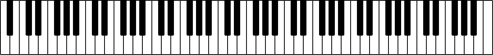

# PianoKeys

Piano keyboard rendered as SVG. This can be used to render a (partial) piano keyboard in the browser.

## Example

Example HTML file:

    <!DOCTYPE html>
    <html lang="en">
    <head>
        <meta charset="UTF-8">
        <meta http-equiv="X-UA-Compatible" content="IE=edge">
        <meta name="viewport" content="width=device-width, initial-scale=1.0">
        <link rel="stylesheet" href="test.css">
        <title>PianoKeys</title>
    </head>
    <body>
        

        
    </body>
    </html>

Example CSS file:

    body {
        margin: 0;
        padding: 0;
    }
    
    #container {
        margin: 0;
        padding: 0;
        background-color: #888;
    }
    
    #container svg {
        display: block;
        margin: auto;
        padding: 36px;
    }

Example script:

    import PianoKeys from './index.js';
    
    const container = document.getElementById('container');
    const keyboard = new PianoKeys.Keyboard(container);

This will render a keyboard corresponding to a regular 88-key piano, starting at the note A0 and ending at C8.

