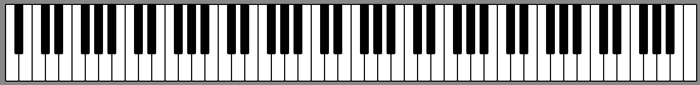
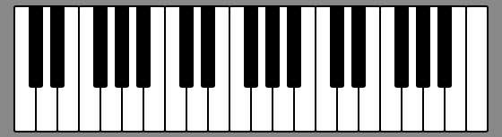
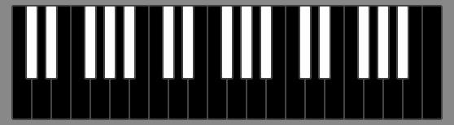
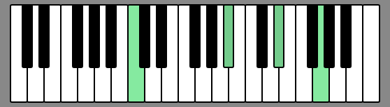
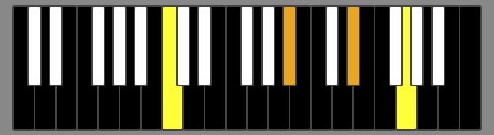

# PianoKeys

Piano keyboard rendered as SVG. This can be used to render a (partial) piano keyboard in the browser.

This package is available in the npm registry. If you are using npm, you can install it into your project with:

    npm i @jesperdj/pianokeys

## Example

Example HTML file (`test.html`):

```html
<!DOCTYPE html>
<html lang="en">
<head>
    <meta charset="UTF-8">
    <meta http-equiv="X-UA-Compatible" content="IE=edge">
    <meta name="viewport" content="width=device-width, initial-scale=1.0">
    <link rel="stylesheet" href="test.css">
    <title>PianoKeys</title>
</head>
<body>
    <div id="container"></div>
    <script type="module" src="test.js"></script>
</body>
</html>
```

Example CSS file (`test.css`):

```css
body {
    margin: 0;
    padding: 0;
}

#container {
    margin: 0;
    padding: 0;
    background-color: #888;
}

#container svg {
    display: block;
    margin: auto;
    padding: 36px;
}
```

Example script (`test.js`):

```javascript
import PianoKeys from './index.js';

const container = document.getElementById('container');
const keyboard = new PianoKeys.Keyboard(container);
```

This will render a keyboard corresponding to a regular 88-key piano, starting at the note A0 and ending at C8.



The constructor of `PianoKeys.Keyboard` takes an optional `options` object as a second parameter. This allows you to set the lowest note, highest note and style properties:

```javascript
import PianoKeys from './index.js';

const container = document.getElementById('container');
const keyboard = new PianoKeys.Keyboard(container, {
    lowest: 'C2',
    highest: 'C5'
});
```



Note names are specified as strings consisting of a note name and octave number. The lowest allowed note is `'C0'`, the highest allowed note is `'B#9'`. The default range is `'A0'` to `'C8'`.

Note: The keyboard always starts and ends with a white key. If you specify a note name that corresponds to a black key, the next lower or higher white key will be used as the lowest or highest note.

You can specify properties for the outline of the keys and the color of the white and black keys:

```javascript
const keyboard = new PianoKeys.Keyboard(container, {
    lowest: 'C2',
    highest: 'C5',
    keyStroke: '#444',
    whiteKeyFill: 'black',
    blackKeyFill: 'white'
});
```



Call `fillKey()` to highlight keys:

```javascript
keyboard.fillKey('C3');
keyboard.fillKey('Bb3');
keyboard.fillKey('Eb4');
keyboard.fillKey('G4');
```



And `clearKey()` to reset a key back to its unhighlighted state.

```javascript
setTimeout(() => {
    keyboard.clearKey('Eb4');
    keyboard.clearKey('G4');
}, 2000);
```

The `fillKey()` function optionally takes a second parameter to set the fill color to use instead of the default color.

```javascript
keyboard.fillKey('C3', 'red');
```

To change the default highlight colors, you can specify them in the options that you pass to the constructor:

```javascript
const keyboard = new PianoKeys.Keyboard(container, {
    lowest: 'C2',
    highest: 'C5',
    keyStroke: '#444',
    whiteKeyFill: 'black',
    whiteKeyHighlightFill: 'yellow',
    blackKeyFill: 'white',
    blackKeyHighlightFill: 'orange'
});
```


